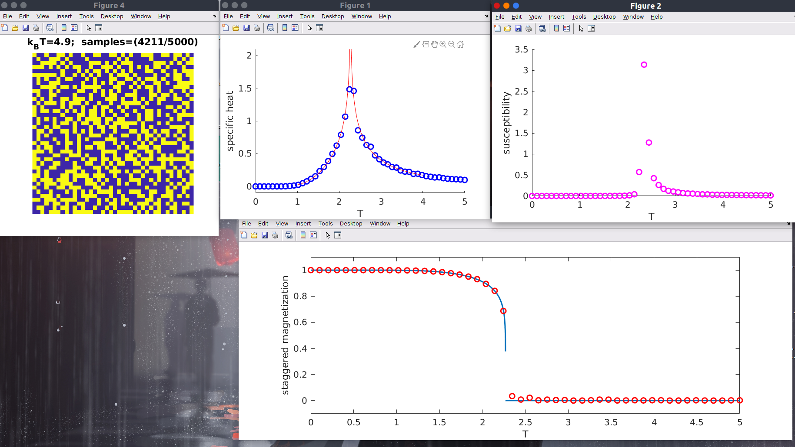
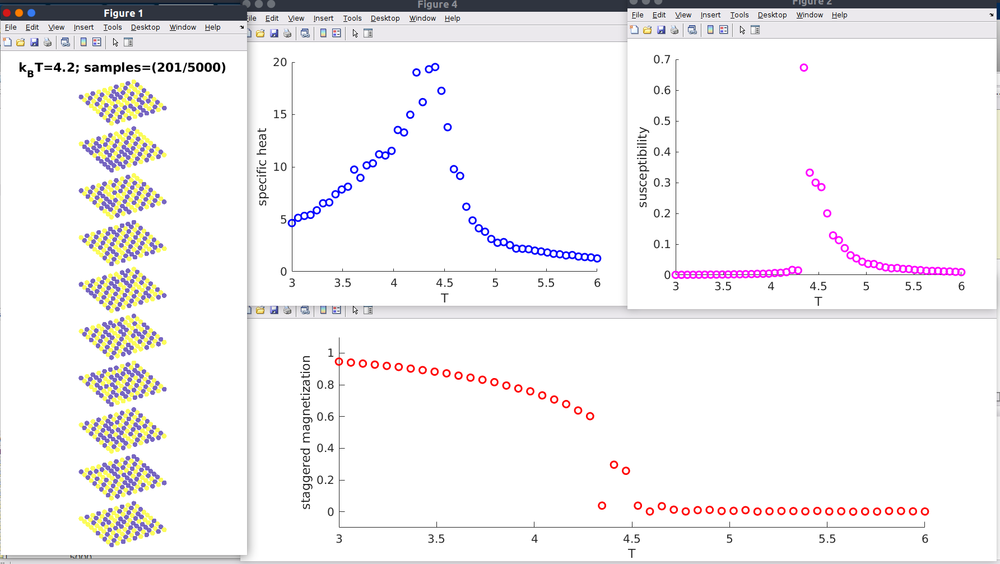

# 2D and 3D Ising simulation

This repository provides a better MATLAB code of Ising simulation. 
The first version of this code is copied from 
[(Jahangirov, 2018) - MSN 514 - Lecture 23 - Ising model](https://www.youtube.com/watch?v=nnw0Xlbj3JM)

## 2D results

## 3D results

## Directory description
- `fig-results` (all plots from the simulation). All the data result from the simulation are stored inside MATLAB figure files `*.fig`
- `ising-2D` (all MATLAB code for 2D Ising simulation). Inside this directory there is two files with prefix `*v2.m`. These files are the modification from the first version with several additional scripts to make a plot during the simulation.

## References
- (Binder and Heerman, 2019) - Monte Carlo Simulation in Statistical Physics, 6th Ed.pdf
- (Newman and Barkema, 1999) - Monte Carlo methods in statistical physics
- (de Jongh and Miedema, 2006) - Experiments on simple magnetic model systems

## To do 
- [x] Anti-ferromagnetic Ising model in 3D.
- [ ] Modified Ising model with singlet. 
- [ ] Update README.md with demonstation of running script
- [ ] Modified Ising model with different $J$. There are two exchange interaction: $J$ and $J_3$. The exchange interaction $J_3$ is used to model doping of holes in p-orbital.
